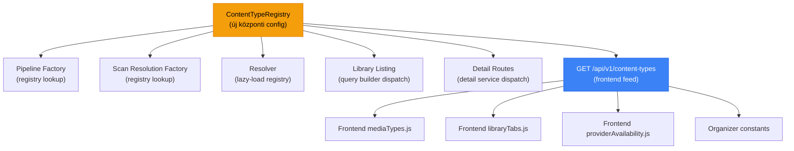
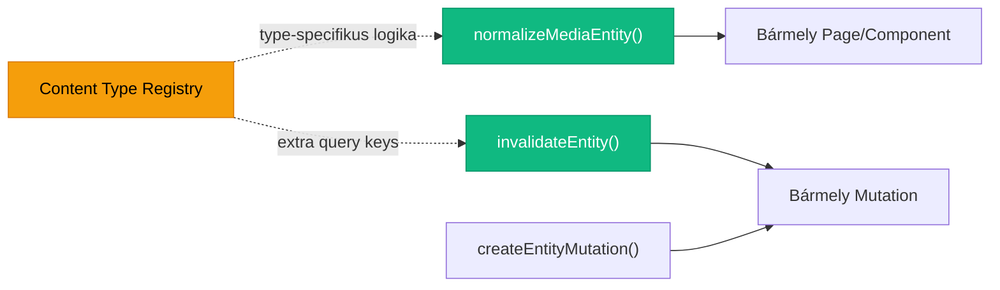

# Pluggable Media Type Registry — "1-2 perc + scraper" rendszer

Cél: Új content type-ok (JAV, anime, offline, stb.) hozzáadása legyen **1 config entry + 1 scraper fájl**, és semmit ne törjön meg a meglévő pipeline-ban.

## Jelenlegi állapot — Problémák

A rendszer jelenleg **hardcoded** `ScanMode` enum-ra épül (`MOVIES_TV`, `SCENES`, `PORNDB_MOVIE`). Új típus hozzáadásához ~15 fájlt kell módosítani:

| Réteg | Hardcoded helyek |
|-------|-----------------|
| Backend enums | `ScanMode`, `MediaType` in [enums.py](file:///e:/projects/python/Swaya/app/shared_kernel/enums.py) |
| Pipeline factory | [factory.py](file:///e:/projects/python/Swaya/app/infrastructure/scrapers/pipelines/factory.py) — `if/elif` lánc |
| Scan resolution | [scan_resolution_pipelines.py](file:///e:/projects/python/Swaya/app/infrastructure/scrapers/scan_resolution_pipelines.py) — `if/elif` lánc |
| Resolver dispatch | [resolver.py](file:///e:/projects/python/Swaya/app/infrastructure/scrapers/resolver.py) — explicit `mainstream`, `adult`, `porndb_movies` |
| Library listing | [library_listing_service.py](file:///e:/projects/python/Swaya/app/application/library/services/library_listing_service.py#L286-L295) — `if tab in ("tv", "adult_tv")` |
| Detail routing | [routes.py](file:///e:/projects/python/Swaya/app/application/library/routes.py#L244-L272) — `if media_type == "scene"` |
| Frontend tabs | [libraryTabs.js](file:///e:/projects/python/Swaya/frontend/src/app/lib/libraryTabs.js) — hardcoded `LIBRARY_TABS` |
| Frontend types | [mediaTypes.js](file:///e:/projects/python/Swaya/frontend/src/app/lib/mediaTypes.js) — hardcoded `MEDIA_TYPES` + dangling `JAV` refs |
| Provider availability | [providerAvailability.js](file:///e:/projects/python/Swaya/frontend/src/app/lib/providerAvailability.js) — `if scanMode === 'scenes'` |
| Organizer constants | [organizerConstants.js](file:///e:/projects/python/Swaya/frontend/src/app/pages/organizer/organizerConstants.js) — hardcoded tabs |

> [!WARNING]
> A [mediaTypes.js](file:///e:/projects/python/Swaya/frontend/src/app/lib/mediaTypes.js#L44) már tartalmaz `MEDIA_TYPES.JAV` hivatkozást ami **nem létezik** az objektumban — ez runtime hiba forrása.

---

## Proposed Changes

### 1. Backend — Content Type Registry

#### [NEW] `app/shared_kernel/content_type_registry.py`

Központi registry, ami definiálja az összes content type-ot és metaadataikat. Új típus hozzáadása = **1 dict entry itt**.

```python
@dataclass(frozen=True)
class ContentTypeDescriptor:
    key: str                    # "jav", "anime", "offline"
    scan_mode: str              # ScanMode enum value
    media_type: str             # MediaType enum value (melyik MediaType-ot írja a match-re)
    provider: str               # default provider key ("r18", "anilist", "local")
    pipeline_class: str         # dotted path a pipeline class-hoz
    resolver_class: str         # dotted path a resolver class-hoz
    enricher_class: str | None  # dotted path az enricher-hez (None = skip)
    query_builder: str          # "movie" | "tv" | "scene" | "custom"
    detail_service: str         # dotted path a detail service-hez
    is_adult: bool              # alapértelmezett is_adult flag
    scan_resolution: str        # dotted path a ScanResolutionPipeline-hoz
    display_name: str           # UI megjelenítési név
    icon: str                   # frontend icon name
    tab_group: str              # melyik library tab alá kerüljön ("movies", "scenes", custom)
    
CONTENT_TYPES: dict[str, ContentTypeDescriptor] = {}

def register_content_type(descriptor: ContentTypeDescriptor): ...
def get_content_type(key: str) -> ContentTypeDescriptor: ...
def get_content_types_for_tab(tab_group: str) -> list[ContentTypeDescriptor]: ...
```

#### [MODIFY] [enums.py](file:///e:/projects/python/Swaya/app/shared_kernel/enums.py)

- `ScanMode`-hoz új értékek: `JAV = "jav"`, `ANIME = "anime"`, `OFFLINE = "offline"` (egyszerű enum bővítés)
- `MediaType`-hoz: `JAV = "jav"` (opcionális — lehet `MOVIE`-t is használni, kérdés alant)

#### [MODIFY] [factory.py](file:///e:/projects/python/Swaya/app/infrastructure/scrapers/pipelines/factory.py)

Lecserélni az `if/elif` láncot registry lookup-ra:

```python
def get_resolver_pipeline(mode, ..., provider=None):
    descriptor = get_content_type(mode.value)
    if descriptor:
        pipeline_cls = import_dotted_path(descriptor.pipeline_class)
        return pipeline_cls(...)  
    # fallback a jelenlegi logikára
    ...
```

#### [MODIFY] [scan_resolution_pipelines.py](file:///e:/projects/python/Swaya/app/infrastructure/scrapers/scan_resolution_pipelines.py)

Ugyanaz a minta: `get_scan_resolution_pipeline()` factory → registry lookup + fallback.

#### [MODIFY] [resolver.py](file:///e:/projects/python/Swaya/app/infrastructure/scrapers/resolver.py)

`Resolver.__init__` → lazy-load resolvereket registry alapján ahelyett, hogy hardcode-olja mind a hármat.

#### [MODIFY] [library_listing_service.py](file:///e:/projects/python/Swaya/app/application/library/services/library_listing_service.py)

`get_library_tab_page()` → registry-ből olvasni, melyik `QueryBuilder`-t kell használni az adott tab-hez.

#### [MODIFY] [routes.py](file:///e:/projects/python/Swaya/app/application/library/routes.py) (library)

`get_library_item_detail()` → registry lookup a `media_type` alapján a megfelelő detail service-hez.

---

### 2. Backend — Példa új típus: JAV scraper

#### [NEW] `app/infrastructure/scrapers/providers/jav.py`

JAV-specifikus scraper client (R18/JavLibrary API). Ez az a rész, ami "1-2 perc + scraper".

#### [NEW] `app/infrastructure/scrapers/pipelines/jav.py`

JAV resolver pipeline (extends `BaseResolverPipeline`).

#### [NEW] `app/infrastructure/scrapers/resolvers/jav_resolver.py`

JAV-specifikus resolver logika.

#### Regisztráció (1 sor a registry-ben):

```python
register_content_type(ContentTypeDescriptor(
    key="jav",
    scan_mode="jav",
    media_type="movie",  # vagy "jav" ha külön MediaType kell
    provider="r18",
    pipeline_class="app.infrastructure.scrapers.pipelines.jav.JavResolverPipeline",
    resolver_class="app.infrastructure.scrapers.resolvers.jav_resolver.JavResolver",
    enricher_class=None,
    query_builder="movie",
    detail_service="app.domains.library.services.detail.movie_detail_service.MovieDetailService",
    is_adult=True,
    scan_resolution="app.infrastructure.scrapers.scan_resolution_pipelines.MainstreamScanResolutionPipeline",
    display_name="JAV",
    icon="Film",
    tab_group="movies",
))
```

---

### 3. Backend — API endpoint a registry lekérdezésére

#### [NEW] Endpoint: `GET /api/v1/content-types`

A frontend innen kérdezi le, milyen content type-ok vannak regisztrálva. Így a frontend teljesen dinamikus lesz.

```json
[
  {
    "key": "movies_tv",
    "display_name": "Movies & TV",
    "icon": "Clapperboard",
    "tab_group": "movies",
    "is_adult": false,
    "has_provider_config": true
  },
  {
    "key": "jav", 
    "display_name": "JAV",
    "icon": "Film",
    "tab_group": "movies",
    "is_adult": true,
    "has_provider_config": true
  }
]
```

---

### 4. Frontend — Dinamikus type támogatás

#### [MODIFY] [mediaTypes.js](file:///e:/projects/python/Swaya/frontend/src/app/lib/mediaTypes.js)

- Fix: `MEDIA_TYPES.JAV` referenciát eltávolítani vagy hozzáadni az objektumhoz
- A `MEDIA_TYPES` és `MEDIA_TYPE_ALIASES`-t dinamikusra cserélni (backend-ről töltve) vagy kiegészíteni egy `registerMediaType()` utility-vel

#### [MODIFY] [libraryTabs.js](file:///e:/projects/python/Swaya/frontend/src/app/lib/libraryTabs.js)

- `LIBRARY_TABS`-t bővíthetővé tenni: alap + registry-ből betöltöttek merge-elése
- `resolveLibraryBackendTab()`, `getLibraryEmptyStateKey()` → generikus mapping a content type key alapján

#### [MODIFY] [providerAvailability.js](file:///e:/projects/python/Swaya/frontend/src/app/lib/providerAvailability.js)

- `getOrganizerProviderOptions()` → registry-ből kiolvasni a provider-eket scanMode alapján
- Vagy: a backend-re áttenni a provider-opciók generálását

#### [MODIFY] [organizerConstants.js](file:///e:/projects/python/Swaya/frontend/src/app/pages/organizer/organizerConstants.js)

- `MAIN_TABS`, `MANUAL_TABS` → registry-ből bővíteni a regisztrált content type-okkal

#### [NEW] Query: `useContentTypesQuery`

```js
export const useContentTypesQuery = () => useQuery({
  queryKey: ['content-types'],
  queryFn: () => api.contentTypes.list(),
  staleTime: Infinity,  // ritkán változik
});
```

---

### 5. Alembic migráció

#### [NEW] Alembic migration

Ha új `ScanMode` / `MediaType` enum értékek kellenek → migráció az SQLite enum bővítéséhez. SQLAlchemy Enum-ok SQLite-ban string-ként tárolódnak, szóval valószínűleg **nem kell** migráció, de validálni kell.

---

## Open Questions

> [!IMPORTANT]
> **Kell-e külön `MediaType` enum érték minden új content type-hoz?**
> 
> Opció A: Minden content type saját `MediaType`-ot kap (`JAV`, `ANIME`, stb.) — explicit, de inflate-álja az enumot.
> 
> Opció B: A meglévő `MediaType.MOVIE` / `MediaType.SCENE`-t reuse-oljuk, és a content type megkülönböztetése a `MetadataMatch.provider` + egy új `content_type` mező alapján történik — kevesebb enum érték, de a `content_type` mező kell a DB-be.
> 
> Melyiket preferálod?

> [!IMPORTANT]
> **A frontend dinamikusan töltse a content type-okat API-ból, vagy statikusan legyen bővítve?**
> 
> Dinamikus = nincs frontend deploy ha új type jön, de bonyolultabb. Statikus = egyszerűbb, de frontend kód is kell minden új type-hoz.

> [!IMPORTANT]
> **Az "offline" type (API nélküli, tisztán helyi fájlok) bekerüljön-e ebbe a rendszerbe, vagy az a Plan #2 (Onboarding Zero-Config) külön feature marad?**

---

## Összefoglaló — Mi változik hol



## Verification Plan

### Automated Tests
- `python -m pytest` — meglévő tesztek nem törnek el
- Új unit tesztek a registry-re: regisztráció, lookup, fallback viselkedés

### Manual Verification
- Scan indítás `MOVIES_TV` és `SCENES` mode-dal → ugyanúgy működik mint eddig
- Új JAV type regisztrálása → scraper nélkül is bekerül a rendszerbe mint válaszható scan mode
- Frontend library tabok dinamikusan bővülnek

---

## 6. Unified Frontend Data Layer — Egységes adat/cache kezelés

### Probléma

Jelenleg minden új page/feature ami médiát jelenít meg, manuálisan kell:
1. **Entity assembly** — poster/backdrop/logo path-ok kiválogatása (~5 fallback kombináció), rating prioritás (IMDb > TMDB > PornDB), title resolution (override > localized > original)
2. **Cache invalidáció** — minden mutáció (poster csere, watched toggle, peak add, tag update) 8-15 `invalidateQueries` hívással dolgozik, az ID variánsokat manuálisan kell kezelni (`itemId`, `cleanId`, `tv_${id}`, `collection_${id}`, `stash_${id}`, `porndb_${id}`, stb.)
3. **Optimistic update** — a library lista, detail oldal, és TV detail cache-ét mind külön-külön frissíti hasonló de nem azonos traversal logikával
4. **Image URL resolution** — `resolveMediaImageUrl()` és `getPosterImagePath()` használata szétszórva a komponensekben

### Ismétlődő minták a kódban

| Minta | Hol ismétlődik | Ismétlések száma |
|-------|----------------|-----------------|
| ID variáns generálás (`cleanId`, `tv_`, `collection_`) | `mediaMutations`, `mediaAssetMutations`, `mediaPeakMutations` | ~6 mutation × ~8 key = ~48 invalidate hívás |
| Detail cache frissítés (`library-item-detail`, `library-tv-detail`, `full-metadata`) | Minden mutation `onSuccess`-ben | ~6 mutation |
| Library lista traversal (recursive `updateItem`) | `useUpdateMediaStatusMutation`, `mediaAssetMutations` | 2 helyen, eltérő implementáció |
| Poster/backdrop path assembly | `imageUrls.js` + inline a komponensekben | szétszórt |

### Proposed Solution: 3 réteg

#### A) Query Key Registry + `invalidateEntity()` helper

```js
// lib/queryKeys.js
export const QUERY_KEYS = {
  libraryList: ['library'],
  stats: ['stats'],
  continueWatching: ['continue-watching'],
  recommendations: ['recommendations'],
  // ... 
};

// Egy entitáshoz tartozó összes query key variáns
export const entityQueryKeys = (rawId) => {
  const cleanId = String(rawId).replace(/^(tv_|collection_|stash_|porndb_|fansdb_|tmdb_)/, '');
  return {
    rawId,
    cleanId,
    detailKeys: [
      ['library-item-detail', rawId],
      ['library-item-detail', cleanId],
      ['library-tv-detail', rawId],
      ['library-tv-detail', cleanId],
      ['library-tv-detail', `tv_${cleanId}`],
      ['full-metadata', rawId],
      ['full-metadata', cleanId],
      ['library-collection-detail', rawId],
      ['library-collection-detail', cleanId],
    ],
  };
};

// Egységes invalidáció 
export const invalidateEntity = (queryClient, rawId, { lists = false, stats = false } = {}) => {
  const { detailKeys } = entityQueryKeys(rawId);
  detailKeys.forEach(key => queryClient.invalidateQueries({ queryKey: key }));
  if (lists) queryClient.invalidateQueries({ queryKey: QUERY_KEYS.libraryList });
  if (stats) queryClient.invalidateQueries({ queryKey: QUERY_KEYS.stats });
};
```

**Hatás:** A 48+ kézi `invalidateQueries` hívás → 1 `invalidateEntity(qc, itemId, { lists: true, stats: true })` hívás.

#### B) `normalizeMediaEntity()` — Egységes entity formázás

```js
// lib/mediaEntity.js  
export const normalizeMediaEntity = (rawItem, { preferredLanguage = 'hu' } = {}) => {
  // Közös adatfeldolgozás ami most szét van szórva a komponensekben:
  return {
    ...rawItem,
    // Title resolution chain
    displayTitle: rawItem.custom_title || rawItem.title || rawItem.original_title || rawItem.filename,
    // Poster resolution chain  
    displayPoster: rawItem.local_poster_path || rawItem.poster_path || rawItem.tv_poster_path || null,
    // Backdrop resolution chain
    displayBackdrop: rawItem.local_backdrop_path || rawItem.backdrop_path || null,
    // Rating priority
    displayRating: rawItem.imdb_rating || rawItem.rating_tmdb || rawItem.rating_porndb || null,
    // Image URLs (pre-resolved)
    posterUrl: resolveMediaImageUrl(rawItem.local_poster_path || rawItem.poster_path, 'poster'),
    backdropUrl: resolveMediaImageUrl(rawItem.local_backdrop_path || rawItem.backdrop_path, 'backdrop'),
  };
};
```

**Használat:** Queryknél `select`-ben, vagy egy custom hook-ban:

```js
export const useMediaDetail = (itemId, mediaType) => {
  const query = useLibraryItemDetailQuery(itemId, { mediaType });
  return {
    ...query,
    data: query.data ? normalizeMediaEntity(query.data) : undefined,
  };
};
```

#### C) Mutation factory — Közös cache-kezelési minta

```js
// queries/mutationHelpers.js
export const createEntityMutation = (queryClient, { 
  mutationFn, 
  entityIdFrom,           // (variables) => rawId
  invalidateOptions = {}, // { lists, stats, tags, recommendations }
  optimisticUpdate,       // optional (oldData, variables) => newData  
}) => ({
  mutationFn,
  onSuccess: (data, variables) => {
    const rawId = entityIdFrom(variables);
    invalidateEntity(queryClient, rawId, invalidateOptions);
  },
  // + optional optimistic logic
});
```

**Hatás:** Minden mutation 3-5 sor konfigurációvá válik:

```js
export const useOverridePosterMutation = () => {
  const qc = useQueryClient();
  return useMutation(createEntityMutation(qc, {
    mutationFn: ({ itemId, posterPath, mediaType }) => api.media.overridePoster(itemId, posterPath, mediaType),
    entityIdFrom: (v) => v.itemId,
    invalidateOptions: { lists: true, recommendations: true },
  }));
};
```

### Módosítandó fájlok

| Fájl | Változás |
|------|---------|
| **[NEW]** `src/app/lib/queryKeys.js` | Query key constants + `entityQueryKeys()` + `invalidateEntity()` |
| **[NEW]** `src/app/lib/mediaEntity.js` | `normalizeMediaEntity()` egységes entity formázás |
| **[NEW]** `src/app/queries/mutationHelpers.js` | `createEntityMutation()` factory |
| **[MODIFY]** `mediaMutations.js` | Átírás `createEntityMutation` + `invalidateEntity` használatra |
| **[MODIFY]** `mediaAssetMutations.js` | Átírás — ~270 sor → ~80 sor |
| **[MODIFY]** `mediaPeakMutations.js` | Átírás — `invalidateEntity` használat |

### Összefüggés a Content Type Registry-vel

Ha a content type registry bekerül, akkor a `normalizeMediaEntity()` automatikusan tud type-specifikus logikát is végrehajtani (pl. JAV-nál más title format, scene-nél más poster aspect ratio), és az `entityQueryKeys()` bővíthető lesz új query key mintákkal anélkül, hogy minden mutationt módosítani kéne.


# Egységesítési lehetőségek — Payoff/Energia rangsor

A kódbázis teljes átvizsgálása alapján, **legnagyobb megtérülés / legkisebb energia** sorrendben:

---

## 1. 🟢 Cache invalidáció egységesítés (`invalidateEntity`)

| | |
|---|---|
| **Energia** | ~1-2 óra |
| **Payoff** | Nagyon magas |
| **Kód csökkenés** | ~200 sor törlés a mutation fájlokból |
| **Törési kockázat** | Minimális — belső refactor |

**Mit csinál:** Jelenleg 6 mutation fájl × 8-15 `invalidateQueries` hívás mindegyikben, az ID variánsokat (`cleanId`, `tv_`, `collection_`, `stash_`, `porndb_`, `fansdb_`, `tmdb_`) kézzel generálja. Egy `invalidateEntity(queryClient, rawId, options)` helper mindent megold.

**Érintett fájlok:** `mediaMutations.js` (496 sor), `mediaAssetMutations.js` (270 sor), `mediaPeakMutations.js` (155 sor)

**Miért #1:** Legkisebb befektetés, legnagyobb azonnali hatás. Minden jövőbeli mutation automatikusan profitál.

---

## 2. 🟢 Media card rendering egységesítés

| | |
|---|---|
| **Energia** | ~3-4 óra |
| **Payoff** | Magas |
| **Kód csökkenés** | ~300-400 sor összevonás |
| **Törési kockázat** | Közepes — UI érint |

**Mit csinál:** A `PosterCard` generikus UI primitív, de minden felhasználási hely (`LibraryPosterCard`, `ContinueWatchingWidget`, `RecommendationsWidget`, `SearchPage`, `DrawerResultsList`, `PersonCreditsCard`) **újra és újra összeállítja** ugyanazt:
- poster/backdrop path kiválogatás (5+ fallback kombináció)
- rating prioritás (IMDb > TMDB > PornDB)
- title resolution (override > localized > original)
- subtitle formázás (year, info, performers)

Egy `normalizeMediaEntity()` + egy `<MediaContentCard>` wrapper ami a normalizált entitásból renderel, mindezt egyszer definiálná.

**Érintett fájlok:** `LibraryPosterCard.jsx` (294 sor), `ContinueWatchingWidget.jsx`, `RecommendationsWidget.jsx` (580 sor), `SearchPage.jsx`, `DrawerResultsList.jsx`, `PersonCreditsCard.jsx`

---

## 3. 🟢 Image URL resolution centralizálás

| | |
|---|---|
| **Energia** | ~1 óra |
| **Payoff** | Közepes-Magas |
| **Kód csökkenés** | Kevés (inkább konzisztencia) |
| **Törési kockázat** | Alacsony |

**Mit csinál:** `resolveMediaImageUrl` **32 fájlban** van importálva, és 5 különböző helper (`getPosterImagePath`, `getTvPosterImagePath`, `getProfileImagePath`, `getBackdropImagePath`, `resolveDetailsImageUrl`) létezik ugyanarra. Plusz `detailUtils.js` wrappereli `resolveDetailsImageUrl`-ben ami pont ugyanaz.

**Megoldás:** A `normalizeMediaEntity()` (lásd #2) pre-resolve-olja az URL-eket, és a komponensek `item.posterUrl`-t használnak `resolveMediaImageUrl(getPosterImagePath(item), 'poster')` helyett.

**Ez a #2-vel együtt jár** — önmagában is megéri, de a #2-vel kombinálva dupla hatás.

---

## 4. 🟡 Backend detail service-ek generalizálása

| | |
|---|---|
| **Energia** | ~4-5 óra |
| **Payoff** | Közepes |
| **Kód csökkenés** | ~200 sor |
| **Törési kockázat** | Közepes |

**Mit csinál:** `MovieDetailService`, `TvDetailService`, `SceneDetailService` — három külön service ami nagyrészt ugyanazt csinálja (match lookup → localization → override → format response), de type-specifikus elágazásokkal. A route handler (`get_library_item_detail`) `if media_type == "scene"` / `"movie"` / `"tv"` if-lánccal dispatch-el.

**Megoldás:** Közös `BaseDetailService` + type-specifikus formatterek. Ez a **content type registry** előfeltétele is — ha a detail dispatch generikus, akkor új type = új formatter, nem új service + route módosítás.

---

## 5. 🟡 Rating display logika (PosterCard + detail)

| | |
|---|---|
| **Energia** | ~30 perc |
| **Payoff** | Alacsony-Közepes |
| **Kód csökkenés** | ~50 sor |
| **Törési kockázat** | Minimális |

**Mit csinál:** A rating prioritás (IMDb > TMDB > PornDB) **3 helyen** van implementálva eltérő módon:
- `PosterCard.jsx` (L256-285) — inline IIFE a JSX-ben
- `LibraryPosterCard.jsx` (L71-86) — props assembly
- `RecommendationsWidget.jsx` (L28-30) — `SpotlightBanner`-ben

**Megoldás:** `resolveRating(item) → { value, source, formatted }` egyetlen helper.

**A #2-vel együtt jár** — ha a `normalizeMediaEntity()` elkészül, ez benne lesz.

---

## 6. 🟡 Episode number parsing/formatting

| | |
|---|---|
| **Energia** | ~30 perc |
| **Payoff** | Alacsony |
| **Kód csökkenés** | ~40 sor |
| **Törési kockázat** | Minimális |

**Mit csinál:** Episode szám parsing/formatting **2 helyen** van duplikálva:
- `ContinueWatchingWidget.jsx` (L10-49) — `normalizeEpisodeNumbers()` + `formatEpisodeCode()`
- `detailUtils.js` (L46-63) — `formatEpisodeNumber()`

Két különböző implementáció, hasonló de nem azonos logikával.

**Megoldás:** Egyetlen `episodeFormat.js` utility.

---

## 7. 🔴 Content Type Registry (backend + frontend)

| | |
|---|---|
| **Energia** | ~8-12 óra |
| **Payoff** | Magas — de **csak ha** új type-ok jönnek |
| **Kód csökkenés** | ~0 (absztrakció hozzáadás) |
| **Törési kockázat** | Közepes-Magas |

Ez a plan §1-5. A legnagyobb scope, a legtöbb érintett fájl, és a payoff csak akkor realizálódik, ha ténylegesen jönnek új type-ok. **Az összes fenti (#1-#6) előfeltétele annak, hogy ez gyorsan és tisztán menjen.**

---

## Javasolt sorrend

```
#1 invalidateEntity        [1-2h]  ← azonnal fizet, 0 kockázat
#5 resolveRating helper    [30min] ← kis erőfeszítés, közben melegítés
#6 episodeFormat utility   [30min] ← kis erőfeszítés
#3 image URL centralizálás [1h]    ← normalizeMediaEntity előkészítés
#2 normalizeMediaEntity    [3-4h]  ← nagy payoff, #3 és #5 beolvad
#4 backend detail services [4-5h]  ← registry előkészítés
#7 content type registry   [8-12h] ← minden előzőre épít
```

**Teljes idő:** ~18-25 óra ha mindent csinálunk, de az első 4 lépés (~3 óra) már az érték 60%-át hozza.
