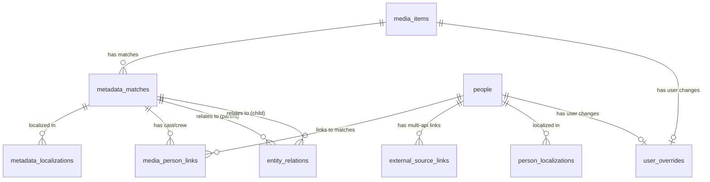
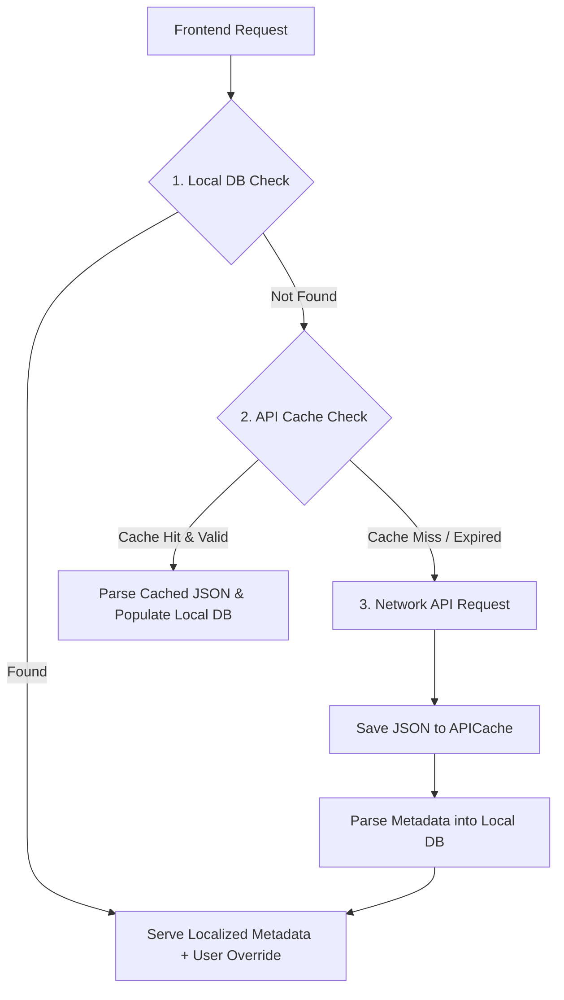
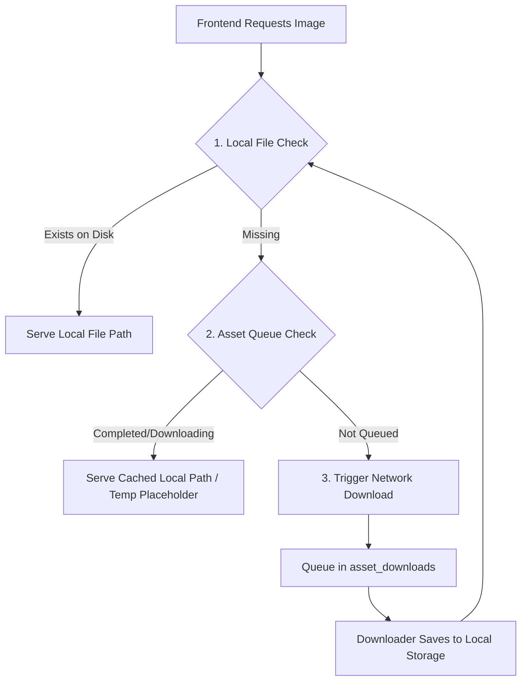

# RENDA Backend Database Architecture & Redesign Proposal

This document outlines the architectural blueprint for rewriting the RENDA backend from scratch, focusing on database optimization, zero-hassle desktop deployment, multi-provider integration, and clean user override management.

---

## 1. Engine & Deployment Strategy: SQLite vs. PostgreSQL in Desktop Apps

For a desktop application where ease of installation is paramount, we must balance database features with deployment friction.

### Comparison Table

| Feature / Trade-off | PostgreSQL (Bundled/Portable) | SQLite (Optimized WAL Mode) |
| :--- | :--- | :--- |
| **Deployment Friction** | Medium (Requires background process management, dynamic port binding, antivirus/firewall exceptions) | **Zero** (Serverless, single file database) |
| **Concurrency** | **High** (MVCC - multi-version concurrency control, reads and writes never block each other) | **Medium** (WAL mode allows concurrent reads, but writes are serialized) |
| **JSON Operations** | **Excellent** (Native JSONB support, indexable, fast deep-querying) | **Good** (Native JSON1 functions, but indexing inner fields requires virtual columns) |
| **Platform Portability** | Low (Requires packaging separate bin/executables for Windows, macOS, Linux) | **High** (Pure Python/OS library, works everywhere natively) |
| **Crash Recovery** | Complex (Orphaned process lock files `postmaster.pid` must be cleaned up on crash) | **Excellent** (Automatic rollback and journal recovery handled by the driver) |

### Optimal Setup Recommendation: Optimized SQLite (WAL Mode)

Instead of the complexity of embedding a PostgreSQL server, we recommend keeping **SQLite** but applying professional production configurations in SQLAlchemy to bypass common bottlenecks:

```python
from sqlalchemy import create_engine, event

engine = create_engine(
    "sqlite:///stash-go.sqlite",
    connect_args={
        "timeout": 30,             # Keep waiting up to 30s instead of throwing "Database is locked"
        "check_same_thread": False # Required for multi-threaded/async FastAPI usage
    }
)

@event.listens_for(engine, "connect")
def set_sqlite_pragma(dbapi_connection, connection_record):
    cursor = dbapi_connection.cursor()
    # 1. WAL Mode: Concurrent reads do not block writes, and vice-versa
    cursor.execute("PRAGMA journal_mode=WAL;")
    # 2. Sync Normal: Much faster disk writes in WAL mode while maintaining safety
    cursor.execute("PRAGMA synchronous=NORMAL;")
    # 3. Foreign Key Constraints: Ensures cascading deletes work perfectly
    cursor.execute("PRAGMA foreign_keys=ON;")
    # 4. Cache Size: Allocate 64MB of RAM for caching query pages
    cursor.execute("PRAGMA cache_size=-64000;")
    cursor.close()
```

---

## 2. Multi-Provider & Polymorphic Metadata Schema

To avoid creating separate tables for every new metadata source (TMDB, StashDB, PornDB, FansDB, OMDB), we introduce a unified, polymorphic **`MetadataMatch`** structure.

### Architecture diagram



---

## 3. SQLAlchemy 2.0 Schema Implementation

This unified schema centralizes all enums, separates external metadata from user edits, and incorporates a centralized cache and history logs.

```python
import enum
from datetime import datetime
from typing import List, Optional, Any
from sqlalchemy import String, Integer, Float, DateTime, Enum as SQLEnum, JSON, Boolean, ForeignKey, UniqueConstraint
from sqlalchemy.orm import DeclarativeBase, Mapped, mapped_column, relationship

class Base(DeclarativeBase):
    pass

# ==========================================
# 3.1 Centralized Enums (Típusbiztonság)
# ==========================================
class Provider(enum.Enum):
    TMDB = "tmdb"
    OMDB = "omdb"
    STASHDB = "stashdb"
    PORNDB = "porndb"
    FANSDB = "fansdb"
    MANUAL = "manual"

class MediaType(enum.Enum):
    MOVIE = "movie"
    TV = "tv"
    SEASON = "season"
    EPISODE = "episode"
    SCENE = "scene"
    PERSON = "person"
    VIDEO = "video"
    COLLECTION = "collection"

class RoleType(enum.Enum):
    ACTOR = "actor"
    DIRECTOR = "director"
    WRITER = "writer"
    PRODUCER = "producer"

# ==========================================
# 3.2 Unified API Cache
# ==========================================
class APICache(Base):
    """
    Unified cache table for all external API queries.
    Prevents redundant HTTP calls and speed up response times.
    """
    __tablename__ = "api_caches"
    
    id: Mapped[int] = mapped_column(primary_key=True)
    provider: Mapped[Provider] = mapped_column(SQLEnum(Provider), index=True)
    cache_key: Mapped[str] = mapped_column(String, unique=True, index=True) # e.g. "tmdb/movie/550" or "stashdb/scene/uuid"
    raw_data: Mapped[dict[str, Any]] = mapped_column(JSON)
    updated_at: Mapped[datetime] = mapped_column(DateTime, default=datetime.utcnow, onupdate=datetime.utcnow)
    expires_at: Mapped[Optional[datetime]] = mapped_column(DateTime, nullable=True, index=True)

# ==========================================
# 3.3 Core Media Item (Filesystem Level)
# ==========================================
class MediaItem(Base):
    """Level 1: The physical file asset residing on the local drive."""
    __tablename__ = "media_items"
    
    id: Mapped[int] = mapped_column(primary_key=True)
    filename: Mapped[str] = mapped_column(String, index=True)
    current_path: Mapped[str] = mapped_column(String, unique=True)
    file_hash: Mapped[Optional[str]] = mapped_column(String, index=True)
    size: Mapped[int] = mapped_column(Integer, default=0)
    created_at: Mapped[datetime] = mapped_column(DateTime, default=datetime.utcnow)
    
    # Relationships
    matches: Mapped[List["MetadataMatch"]] = relationship(back_populates="media_item", cascade="all, delete-orphan")
    overrides: Mapped[Optional["UserOverride"]] = relationship(back_populates="media_item", cascade="all, delete-orphan")
    playback_logs: Mapped[List["PlaybackLog"]] = relationship(back_populates="media_item", cascade="all, delete-orphan")

# ==========================================
# 3.4 Polymorphic Metadata Match
# ==========================================
class MetadataMatch(Base):
    """Level 2: The external scraper match record from TMDB, StashDB, etc."""
    __tablename__ = "metadata_matches"
    __table_args__ = (UniqueConstraint("provider", "external_id", "media_type", name="uq_provider_match"),)

    id: Mapped[int] = mapped_column(primary_key=True)
    media_item_id: Mapped[Optional[int]] = mapped_column(ForeignKey("media_items.id", ondelete="CASCADE"), nullable=True, index=True)
    
    provider: Mapped[Provider] = mapped_column(SQLEnum(Provider), index=True)
    external_id: Mapped[str] = mapped_column(String, index=True) # e.g. TMDB Movie ID (int) or StashDB Scene UUID
    media_type: Mapped[MediaType] = mapped_column(SQLEnum(MediaType), index=True)
    
    rating: Mapped[Optional[float]] = mapped_column(Float)
    release_date: Mapped[Optional[datetime]] = mapped_column(DateTime)
    imdb_id: Mapped[Optional[str]] = mapped_column(String, index=True) # Global cross-reference ID (e.g. tt1234567)
    raw_metadata: Mapped[Optional[dict]] = mapped_column(JSON) # Store raw JSON payload for non-critical query fields
    
    studio_id: Mapped[Optional[int]] = mapped_column(ForeignKey("studios.id", ondelete="SET NULL"), nullable=True, index=True)
    
    # Relationships
    media_item: Mapped[Optional["MediaItem"]] = relationship(back_populates="matches")
    localizations: Mapped[List["MetadataLocalization"]] = relationship(back_populates="match", cascade="all, delete-orphan")
    people: Mapped[List["MediaPersonLink"]] = relationship(back_populates="match", cascade="all, delete-orphan")
    studio: Mapped[Optional["Studio"]] = relationship(back_populates="matches")

# ==========================================
# 3.5 Localization Layer (Language Sync)
# ==========================================
class MetadataLocalization(Base):
    """Level 3: Multi-language text/image support linked to the metadata match."""
    __tablename__ = "metadata_localizations"
    __table_args__ = (UniqueConstraint("match_id", "locale", name="uq_match_locale"),)

    id: Mapped[int] = mapped_column(primary_key=True)
    match_id: Mapped[int] = mapped_column(ForeignKey("metadata_matches.id", ondelete="CASCADE"), index=True)
    locale: Mapped[str] = mapped_column(String, default="en", index=True) # "hu", "en", etc.
    
    title: Mapped[str] = mapped_column(String)
    overview: Mapped[Optional[str]] = mapped_column(String)
    poster_path: Mapped[Optional[str]] = mapped_column(String)
    backdrop_path: Mapped[Optional[str]] = mapped_column(String)
    
    match: Mapped["MetadataMatch"] = relationship(back_populates="localizations")

# ==========================================
# 3.6 Cast & Crew (People)
# ==========================================
class Person(Base):
    """Global cast/crew database entry. Can be referenced by mainstream and adult matches."""
    __tablename__ = "people"
    
    id: Mapped[int] = mapped_column(primary_key=True)
    name: Mapped[str] = mapped_column(String, index=True)
    gender: Mapped[Optional[int]] = mapped_column(Integer)
    profile_path: Mapped[Optional[str]] = mapped_column(String)
    external_ids: Mapped[Optional[dict]] = mapped_column(JSON) # {"tmdb": "123", "stashdb": "uuid-xyz"}
    
    media_links: Mapped[List["MediaPersonLink"]] = relationship(back_populates="person")
    localizations: Mapped[List["PersonLocalization"]] = relationship(back_populates="person", cascade="all, delete-orphan")
    overrides: Mapped[Optional["UserOverride"]] = relationship(back_populates="person", cascade="all, delete-orphan")

class PersonLocalization(Base):
    """Multi-language metadata for actors/performers (e.g. biography, alias names)."""
    __tablename__ = "person_localizations"
    __table_args__ = (UniqueConstraint("person_id", "locale", name="uq_person_locale"),)

    id: Mapped[int] = mapped_column(primary_key=True)
    person_id: Mapped[int] = mapped_column(ForeignKey("people.id", ondelete="CASCADE"), index=True)
    locale: Mapped[str] = mapped_column(String, default="en", index=True) # "hu", "en"
    
    biography: Mapped[Optional[str]] = mapped_column(String)
    
    person: Mapped["Person"] = relationship(back_populates="localizations")

class MediaPersonLink(Base):
    """Link mapping people to movies/shows/scenes with roles."""
    __tablename__ = "media_person_links"
    
    id: Mapped[int] = mapped_column(primary_key=True)
    match_id: Mapped[int] = mapped_column(ForeignKey("metadata_matches.id", ondelete="CASCADE"), index=True)
    person_id: Mapped[int] = mapped_column(ForeignKey("people.id", ondelete="CASCADE"), index=True)
    role: Mapped[RoleType] = mapped_column(SQLEnum(RoleType), index=True) # Actor, Director, etc.
    character_name: Mapped[Optional[str]] = mapped_column(String)
    
    match: Mapped["MetadataMatch"] = relationship(back_populates="people")
    person: Mapped["Person"] = relationship(back_populates="media_links")

# ==========================================
# 3.7 User Overrides (isolated customization)
# ==========================================
class UserOverride(Base):
    """
    Stores all manual user adjustments. This isolates user data completely
    from incoming scraped data so that rescrapes NEVER overwrite user edits.
    """
    __tablename__ = "user_overrides"
    
    id: Mapped[int] = mapped_column(primary_key=True)
    media_item_id: Mapped[Optional[int]] = mapped_column(ForeignKey("media_items.id", ondelete="CASCADE"), unique=True, nullable=True)
    metadata_match_id: Mapped[Optional[int]] = mapped_column(ForeignKey("metadata_matches.id", ondelete="CASCADE"), unique=True, nullable=True)
    person_id: Mapped[Optional[int]] = mapped_column(ForeignKey("people.id", ondelete="CASCADE"), unique=True, nullable=True)
    
    custom_title: Mapped[Optional[str]] = mapped_column(String)
    custom_overview: Mapped[Optional[str]] = mapped_column(String)
    custom_poster: Mapped[Optional[str]] = mapped_column(String)
    custom_backdrop: Mapped[Optional[str]] = mapped_column(String)
    
    user_rating: Mapped[Optional[int]] = mapped_column(Integer)
    user_comment: Mapped[Optional[str]] = mapped_column(String)
    custom_tags: Mapped[Optional[List[str]]] = mapped_column(JSON)
    is_favorite: Mapped[bool] = mapped_column(Boolean, default=False, index=True)
    is_watched: Mapped[bool] = mapped_column(Boolean, default=False, index=True)
    
    media_item: Mapped[Optional["MediaItem"]] = relationship(back_populates="overrides")
    metadata_match: Mapped[Optional["MetadataMatch"]] = relationship()
    person: Mapped[Optional["Person"]] = relationship(back_populates="overrides")

# ==========================================
# 3.8 Logs & History
# ==========================================
class PlaybackLog(Base):
    """
    Every time a user plays a file, a log entry is created.
    This generates 'watch_count' (count of entries) and 'last_watched_at' (max date) dynamically.
    """
    __tablename__ = "playback_logs"
    
    id: Mapped[int] = mapped_column(primary_key=True)
    media_item_id: Mapped[int] = mapped_column(ForeignKey("media_items.id", ondelete="CASCADE"), index=True)
    watched_at: Mapped[datetime] = mapped_column(DateTime, default=datetime.utcnow, index=True)
    position_seconds: Mapped[int] = mapped_column(Integer, default=0) # Last playback position
    
    media_item: Mapped["MediaItem"] = relationship(back_populates="playback_logs")

class PlaybackPeakLog(Base):
    """
    Tracks climax / hot-spots / peak moments marked by the user or based on rewatch loops.
    """
    __tablename__ = "playback_peak_logs"
    
    id: Mapped[int] = mapped_column(primary_key=True)
    media_item_id: Mapped[int] = mapped_column(ForeignKey("media_items.id", ondelete="CASCADE"), index=True)
    video_position: Mapped[int] = mapped_column(Integer) # Position in seconds
    created_at: Mapped[datetime] = mapped_column(DateTime, default=datetime.utcnow, index=True)

class ActionBatch(Base):
    """Represents a group of file/metadata operations executed together (enables Undo/Redo)."""
    __tablename__ = "action_batches"
    
    id: Mapped[int] = mapped_column(primary_key=True)
    name: Mapped[Optional[str]] = mapped_column(String) # e.g. "Rename Season 1"
    created_at: Mapped[datetime] = mapped_column(DateTime, default=datetime.utcnow)
    
    logs: Mapped[List["ActionLog"]] = relationship(back_populates="batch", cascade="all, delete-orphan")

class ActionLog(Base):
    """Audit log for individual operations (renaming, moving, deleting, matching files)."""
    __tablename__ = "action_logs"
    
    id: Mapped[int] = mapped_column(primary_key=True)
    batch_id: Mapped[int] = mapped_column(ForeignKey("action_batches.id", ondelete="CASCADE"), index=True)
    media_item_id: Mapped[Optional[int]] = mapped_column(ForeignKey("media_items.id", ondelete="SET NULL"), nullable=True, index=True)
    
    action_type: Mapped[str] = mapped_column(String, index=True) # e.g. "rename", "move", "delete", "metadata_update"
    status: Mapped[str] = mapped_column(String, default="success", index=True) # e.g. "success", "failed", "undone"
    
    old_value: Mapped[Optional[str]] = mapped_column(String) # e.g. original path/filename
    new_value: Mapped[Optional[str]] = mapped_column(String) # e.g. target path/filename
    error_message: Mapped[Optional[str]] = mapped_column(String)
    details: Mapped[Optional[dict]] = mapped_column(JSON) # e.g. detailed changes/metadata dict
    created_at: Mapped[datetime] = mapped_column(DateTime, default=datetime.utcnow)
    
    batch: Mapped["ActionBatch"] = relationship(back_populates="logs")
    media_item: Mapped[Optional["MediaItem"]] = relationship()

# ==========================================
# 3.9 Custom User Lists & Watchlists
# ==========================================
class CustomList(Base):
    """User-defined collections (e.g., 'Favorite Sci-Fi', 'To Watch on Weekend')."""
    __tablename__ = "custom_lists"
    
    id: Mapped[int] = mapped_column(primary_key=True)
    name: Mapped[str] = mapped_column(String, index=True)
    description: Mapped[Optional[str]] = mapped_column(String)
    color: Mapped[Optional[str]] = mapped_column(String) # For UI customization
    icon: Mapped[Optional[str]] = mapped_column(String)  # For UI customization
    created_at: Mapped[datetime] = mapped_column(DateTime, default=datetime.utcnow)
    
    items: Mapped[List["CustomListItem"]] = relationship(
        "CustomListItem", back_populates="custom_list", cascade="all, delete-orphan"
    )

class CustomListItem(Base):
    """
    Items inside a custom list. Can link to either a physical file (media_item)
    or a virtual match (metadata_match) which does not yet exist locally.
    """
    __tablename__ = "custom_list_items"
    
    id: Mapped[int] = mapped_column(primary_key=True)
    list_id: Mapped[int] = mapped_column(ForeignKey("custom_lists.id", ondelete="CASCADE"), index=True)
    media_item_id: Mapped[Optional[int]] = mapped_column(ForeignKey("media_items.id", ondelete="CASCADE"), nullable=True, index=True)
    match_id: Mapped[Optional[int]] = mapped_column(ForeignKey("metadata_matches.id", ondelete="CASCADE"), nullable=True, index=True)
    added_at: Mapped[datetime] = mapped_column(DateTime, default=datetime.utcnow)
    
    custom_list: Mapped["CustomList"] = relationship(back_populates="items")
    media_item: Mapped[Optional["MediaItem"]] = relationship()
    match: Mapped[Optional["MetadataMatch"]] = relationship()

# ==========================================
# 3.10 Cross-Provider Links & Entity Relations
# ==========================================
class ExternalSourceLink(Base):
    """
    Links multiple external APIs to a single Person.
    Allows merging TMDB, StashDB, and PornDB profiles for the same actor.
    """
    __tablename__ = "external_source_links"
    __table_args__ = (UniqueConstraint("person_id", "provider", "external_id", name="uq_person_external_source"),)

    id: Mapped[int] = mapped_column(primary_key=True)
    person_id: Mapped[int] = mapped_column(ForeignKey("people.id", ondelete="CASCADE"), index=True)
    provider: Mapped[Provider] = mapped_column(SQLEnum(Provider), index=True)
    external_id: Mapped[str] = mapped_column(String, index=True) # e.g., StashDB performer UUID
    profile_url: Mapped[Optional[str]] = mapped_column(String)

class EntityRelation(Base):
    """
    Handles relations between matches across different providers or media types.
    Enables linking StashDB Scenes to TMDB Movies, or spin-offs/extras.
    """
    __tablename__ = "entity_relations"
    __table_args__ = (UniqueConstraint("parent_match_id", "child_match_id", "relation_type", name="uq_entity_relation"),)

    id: Mapped[int] = mapped_column(primary_key=True)
    parent_match_id: Mapped[int] = mapped_column(ForeignKey("metadata_matches.id", ondelete="CASCADE"), index=True)
    child_match_id: Mapped[int] = mapped_column(ForeignKey("metadata_matches.id", ondelete="CASCADE"), index=True)
    relation_type: Mapped[str] = mapped_column(String, default="scene_in_movie", index=True) # e.g., "scene_in_movie", "spin_off", "extras"
    
    parent: Mapped["MetadataMatch"] = relationship("MetadataMatch", foreign_keys=[parent_match_id])
    child: Mapped["MetadataMatch"] = relationship("MetadataMatch", foreign_keys=[child_match_id])
```

---

## 4. Key Mechanisms & Architectural Patterns

### 4.1 Safe User Edit Merging (Coalesce Pattern)
When querying metadata for the frontend, always use a fallback query that prioritizes `UserOverride` values:

```python
from sqlalchemy.sql.functions import coalesce
from sqlalchemy import select

# Query title prioritizing user custom edit, then falling back to localized title
stmt = (
    select(
        coalesce(UserOverride.custom_title, MetadataLocalization.title).label("display_title")
    )
    .join(MetadataMatch, MediaItem.id == MetadataMatch.media_item_id)
    .join(MetadataLocalization, MetadataMatch.id == MetadataLocalization.match_id)
    .outerjoin(UserOverride, MediaItem.id == UserOverride.media_item_id)
    .where(MediaItem.id == 1, MetadataLocalization.locale == "hu")
)
```

### 4.2 Centralized Cache & Eviction Policy
To support static caching with selective expiration and manual "Force Refresh" actions:

1. **Static Data Cache (Default):** For static entity metadata (Movies, Scenes, Actors), `expires_at` is set to `NULL`. The backend will always serve this from the database without checking external APIs.
2. **Dynamic Data Cache (TTL-based):** For dynamic queries like *Recommendations*, *Trending*, or *Similar Items*, `expires_at` is set to a short duration (e.g., `now + 24 hours`). A background job periodically deletes entries where `expires_at < now`.
3. **On-demand Refresh (Bypass & Force Reload):** When a user clicks "Refresh Metadata" for a specific actor or movie:
   * The backend deletes the associated `APICache` row (by `cache_key`).
   * It fetches the fresh data from the external API.
   * It updates both the `APICache` (storing the new response) and updates the respective `MetadataMatch` / `MetadataLocalization` tables.

```python
# Backend logic for fetching metadata with cache bypass
def get_metadata(cache_key: str, force_refresh: bool = False):
    if force_refresh:
        # Delete old cache entry
        session.query(APICache).filter(APICache.cache_key == cache_key).delete()
        session.commit()
    else:
        # Check cache
        cached = session.query(APICache).filter(APICache.cache_key == cache_key).first()
        if cached and (cached.expires_at is None or cached.expires_at > datetime.utcnow()):
            return cached.raw_data
            
    # Fetch fresh and save
    fresh_data = external_api_call()
    save_to_cache(cache_key, fresh_data)
    return fresh_data
```

### 4.3 Avoiding Type Normalization Redundancies
By using a central Enum file (`enums.py`) and standard SQLAlchemy `SQLEnum` mappings, we ensure that:
* The mapping of strings to database values is handled transparently at the driver level.
* No raw/arbitrary string types are stored for categorization (like `role`, `provider`, `media_type`).
* Frontend and backend share the exact same enum string representations.

### 4.4 Manual Entity Creation (No Scraper)
If a user wants to create a metadata record manually (e.g., local home video, custom scene, actor not present in database):
1. **Create MetadataMatch:** Insert a record into `MetadataMatch` where `provider = Provider.MANUAL` and `external_id` is generated locally (e.g., a UUID or sequential ID like `local-10293`).
2. **Set Media Type:** Use the appropriate `MediaType` value:
   * `MediaType.MOVIE` / `MediaType.SCENE` / `MediaType.SERIES` for typical structures.
   * **`MediaType.VIDEO`**: For random home videos, family recordings, or arbitrary standalone video clips that do not follow movie/series rules.
3. **Link Media Item:** Optionally link `media_item_id` if there is a physical file. If it's a virtual movie/wishlist item, keep it `NULL`.
4. **Localize Fields:** Insert manual details directly into `MetadataLocalization` (e.g. `locale = "hu"`, `title = "My Local Scene"`, `overview = "..."`).
5. **Link Cast/Crew:** Link existing or manually created `people` records via `MediaPersonLink`.
6. **Editing:** Any subsequent manual edits by the user write directly to the `MetadataLocalization` table (since there is no scraper threat of overwriting). Alternatively, they can still write to `UserOverride` to keep edits separated. Both patterns are perfectly supported by this schema.

---

## 5. Additional Recommendations & Missing Pieces

Based on the existing RENDA backend code, here are several crucial database aspects to consider:

### 5.1 Application-Wide User Settings
A global key-value configuration table is required for storing application paths, selected API keys, language configurations, and automatic scanning parameters:

```python
class UserSetting(Base):
    __tablename__ = "user_settings"
    key: Mapped[str] = mapped_column(String, primary_key=True)
    value: Mapped[Any] = mapped_column(JSON) # Stores strings, ints, or nested configurations
    description: Mapped[Optional[str]] = mapped_column(String)
    updated_at: Mapped[datetime] = mapped_column(DateTime, default=datetime.utcnow, onupdate=datetime.utcnow)
```

### 5.2 Decoupling Physical Media Details
Always keep technical file details strictly inside the `MediaItem` table, separate from movie metadata:
* **Audio streams, video codec, resolution, duration, file size, bit_depth.**
* **`group_hash`**: Needed for linking split physical files (e.g. `CD1` and `CD2` representing a single movie match).

### 5.3 Associated/Extra Files (Subtitles & Images)
A separate table is needed for linking external subtitles (`.srt`), local images (manually downloaded posters/backdrops), or trailer clips associated with a `MediaItem`:

```python
class ExtraFile(Base):
    __tablename__ = "extra_files"
    id: Mapped[int] = mapped_column(primary_key=True)
    media_item_id: Mapped[int] = mapped_column(ForeignKey("media_items.id", ondelete="CASCADE"), index=True)
    category: Mapped[str] = mapped_column(String) # e.g. "subtitle", "image", "trailer"
    extension: Mapped[str] = mapped_column(String) # e.g. "srt", "png"
    language: Mapped[Optional[str]] = mapped_column(String) # e.g. "hu", "en"
    file_hash: Mapped[Optional[str]] = mapped_column(String, index=True)
    current_path: Mapped[str] = mapped_column(String, unique=True)
```

### 5.4 Studios & Production Networks (Hierarchy)
To support Networks and Studios/Sites (parent-child relationship) especially for adult metadata (StashDB, PornDB) and mainstream production companies:

```python
class Studio(Base):
    """
    Production studio or network. Supports hierarchical structures
    (e.g., Network/Parent Studio -> Sub-studio/Site).
    """
    __tablename__ = "studios"
    
    id: Mapped[int] = mapped_column(primary_key=True)
    name: Mapped[str] = mapped_column(String, unique=True, index=True)
    logo_path: Mapped[Optional[str]] = mapped_column(String)
    
    # Self-referential hierarchy (Parent Studio / Network)
    parent_studio_id: Mapped[Optional[int]] = mapped_column(ForeignKey("studios.id", ondelete="SET NULL"), index=True)
    
    # Relationships
    parent_studio: Mapped[Optional["Studio"]] = relationship("Studio", remote_side=[id], backref="sub_studios")
    matches: Mapped[List["MetadataMatch"]] = relationship(back_populates="studio")
```

### 5.5 Background Tasks & Asset Downloads
To support pausing, aborting, auto-restarting tasks (after application launch), and tracking image/asset downloads:

```python
class TaskStatus(enum.Enum):
    PENDING = "pending"
    RUNNING = "running"
    PAUSED = "paused"
    COMPLETED = "completed"
    FAILED = "failed"
    ABORTED = "aborted"

class BackgroundTask(Base):
    """
    Stores background jobs (e.g. Scrapers, Renamer, Folder Scanners).
    Allows state recovery, pause/resume, and auto-restart on app startup.
    """
    __tablename__ = "background_tasks"
    
    id: Mapped[str] = mapped_column(String, primary_key=True) # Task UUID or ID (e.g. "scanner-1")
    name: Mapped[str] = mapped_column(String)
    status: Mapped[TaskStatus] = mapped_column(SQLEnum(TaskStatus), default=TaskStatus.PENDING, index=True)
    
    progress: Mapped[float] = mapped_column(Float, default=0.0) # 0.0 to 100.0
    stage: Mapped[Optional[str]] = mapped_column(String) # e.g. "Downloading posters"
    
    auto_restart: Mapped[bool] = mapped_column(Boolean, default=False) # If True, auto-resume on startup
    created_at: Mapped[datetime] = mapped_column(DateTime, default=datetime.utcnow)
    started_at: Mapped[Optional[datetime]] = mapped_column(DateTime, nullable=True)
    updated_at: Mapped[datetime] = mapped_column(DateTime, default=datetime.utcnow, onupdate=datetime.utcnow)
    error_message: Mapped[Optional[str]] = mapped_column(String)

class AssetStatus(enum.Enum):
    PENDING = "pending"
    DOWNLOADING = "downloading"
    COMPLETED = "completed"
    FAILED = "failed"

class AssetDownload(Base):
    """
    Queues and tracks media assets (Posters, Backdrops, Actor Profiles).
    Allows precise progress tracking of downloads.
    """
    __tablename__ = "asset_downloads"
    
    id: Mapped[int] = mapped_column(primary_key=True)
    url: Mapped[str] = mapped_column(String) # Remote image URL
    local_path: Mapped[str] = mapped_column(String) # Destination path
    status: Mapped[AssetStatus] = mapped_column(SQLEnum(AssetStatus), default=AssetStatus.PENDING, index=True)
    attempts: Mapped[int] = mapped_column(Integer, default=0)
    error_message: Mapped[Optional[str]] = mapped_column(String)
    
    # Polymorphic target references (which movie/person needs this asset)
    target_type: Mapped[str] = mapped_column(String, index=True) # "movie", "person", "scene"
    target_id: Mapped[int] = mapped_column(Integer, index=True)
    
    created_at: Mapped[datetime] = mapped_column(DateTime, default=datetime.utcnow)
    updated_at: Mapped[datetime] = mapped_column(DateTime, default=datetime.utcnow, onupdate=datetime.utcnow)
```

**Auto-Restart & Crash Management Logic:**
* **On Startup:** The backend checks the `background_tasks` table. Any task with `auto_restart = True` and status `RUNNING` or `PAUSED` (which indicates the app crashed while the task was active) is automatically queued for execution again.
* **Pause / Abort:** The UI toggles the `status` to `PAUSED` or `ABORTED`. The active worker thread checks this database status at the start of each iteration and pauses/terminates execution accordingly.

### 5.6 Schema Migrations (Alembic Versioning)
Because RENDA is a desktop application, any backend update that modifies the database schema (adding columns, new tables) must execute migrations automatically on startup without deleting user data. We must include a schema tracking table or use **Alembic** which automatically maintains a `alembic_version` table:
* **Startup hook:** On application startup, the backend runs `alembic upgrade head` programmatically before starting the FastAPI/Uvicorn server.

### 5.7 Soft-Delete & External Drive Safety
If a user stores media on an external USB hard drive or NAS, and launches the app while the drive is unplugged:
* **The danger:** An automatic scanner might see that all files are "gone" and delete them from the database, wiping out all custom tags, play counts, and overrides!
* **The solution:** Never hard-delete media items during normal scans when files disappear.
  * Instead, update the status of the `MediaItem` to `MISSING` (or a soft-deleted state).
  * Only delete metadata if the user explicitly triggers a "Clean Library / Clean Database" action from the settings panel with the drive connected.

### 5.8 Library Roots & Path Relativization
If a user mounts their external drive to a different drive letter (e.g., from `D:\Movies` to `E:\Movies`), absolute paths stored in the database will break.
* **The solution:** Introduce a `Library` table containing the absolute root paths, and store paths inside `MediaItem` as **relative paths**.
  ```python
  class Library(Base):
      __tablename__ = "libraries"
      id: Mapped[int] = mapped_column(primary_key=True)
      name: Mapped[str] = mapped_column(String) # e.g. "Main Movies"
      root_path: Mapped[str] = mapped_column(String, unique=True) # e.g. "D:\Movies"
  
  class MediaItem(Base):
      # ...
      library_id: Mapped[int] = mapped_column(ForeignKey("libraries.id", ondelete="CASCADE"), index=True)
      relative_path: Mapped[str] = mapped_column(String, index=True) # e.g. "Fight Club (1999)\movie.mp4"
  ```
  If the drive letter changes, the user only needs to update the `root_path` of the `Library` record, and the entire database instantly matches the new paths!

### 5.9 Standardized Path & URL Resolution (Image Fallback Pipeline)
To prevent absolute file paths from contaminating the database and to ensure robust fallbacks for missing assets:
1. **Never store absolute paths:** Image columns (like `poster_path` or `custom_poster`) must store either:
   * A **Relative Local Path:** relative to the application's global data folder (e.g. `posters/abc.webp`).
   * A **Remote URL:** points directly to the scraper source (e.g. `https://image.tmdb.org/...`).
2. **Serving Flow (Resolution & Fallback):** When the backend API resolves an asset path to send to the frontend:
   * **Step 1 (Override Check):** Prioritize `UserOverride.custom_poster` over `MetadataLocalization.poster_path`.
   * **Step 2 (Local Path Resolution):** If the path is relative, resolve it to an absolute path: `base_data_dir / relative_path`. Check if the file exists on disk.
     * *If it exists:* Serve the file via a dedicated static asset controller endpoint (e.g., `/api/v1/assets/image?path=posters/abc.webp`).
   * **Step 3 (Remote URL Fallback):** If the local file is missing, check if a remote URL exists.
     * *If yes:* Return the remote URL directly so the frontend can stream it, and trigger a background download task (`AssetDownload`) to cache it locally.
   * **Step 4 (Default Placeholder):** If both local and remote assets are missing, return a hardcoded backend placeholder URL (e.g., `/static/placeholders/poster.png`).

This pipeline guarantees the frontend never encounters broken image links.

### 5.10 Standardized Language Scope Configuration
To prevent confusion between different language uses inside the app, the global settings must explicitly separate the three distinct language scopes:

1. **`app_ui_locale` (UI Language):**
   * **Purpose:** The language of the user interface text (buttons, menus, labels).
   * **Example:** Hungarian (`hu`) or English (`en`).
2. **`metadata_fallback_locales` (Metadata Fetching Language):**
   * **Purpose:** An ordered list of languages to query when fetching descriptions/titles from scrapers.
   * **Example:** `["hu", "en"]` (Try fetching Hungarian first; if TMDB doesn't have it, fall back to English).
3. **`renamer_title_locale` (File Renaming Language):**
   * **Purpose:** The language key used to determine how folders and files are renamed on the physical disk.
   * **Values:** `"original"` (native title of the movie/show), `"hu"` (Hungarian title), `"en"` (English title), or `"metadata_preferred"` (matches the highest available from the metadata fallback list).

By decoupling these settings in the `UserSetting` table under these specific keys, the renamer and scraper modules can operate independently without overriding each other's language expectations.

> [!NOTE]
> **Adult Provider Exception:** Since adult metadata providers (StashDB, PornDB, FansDB) do not support multi-language localizations, their incoming scraper responses are mapped directly to the `"en"` locale in `MetadataLocalization` and `PersonLocalization` tables, bypassing the fallback list.

### 5.11 Privacy Lock & Authentication (NSFW Gate)
Because RENDA manages sensitive/adult content, a production-ready desktop app needs a mechanism to prevent unauthorized users (e.g. family members) from accessing the NSFW section.
* **Vault Password/PIN:** Store a hashed version of a security PIN/password in the `UserSetting` table.
* **API Access Protection:** Protect all `/api/v1/adult/*` routes behind a lightweight session token check. If the "adult vault" is locked, the backend blocks all adult requests with a `401 Unauthorized` status code, regardless of the frontend state.

### 5.12 SQLite Maintenance (Vacuum, Analyze & Backup)
Over time, frequent folder scans, file renames, and logging cause SQLite databases to fragment and compile bloated query plans.
* **VACUUM & ANALYZE Startup Job:** On app launch (or during shutdown), the backend should programmatically run maintenance statements:
  ```sql
  PRAGMA optimize; -- Let SQLite optimize query indexes automatically
  ```
  And periodically run a full `VACUUM;` (e.g., once a month or if the database drops significantly in size after cleanups) to compress the database file size.
* **Auto-Backup Scheduler:** Prior to running Alembic schema upgrades or once a week, copy the active `stash-go.sqlite` database file to a `backups/stash-go.sqlite.bak` file in the user's data folder to prevent catastrophic data loss.

---

## 6. Data Flow Strategy: Local > Cache > Network

To ensure instant UI response times and offline usability, the backend follows a strict hierarchy for serving data and assets.

### 6.1 Metadata Retrieval Pipeline
When the frontend requests details for a movie, show, or scene:



1. **Local DB (Fastest):** Check the local tables (`MetadataMatch`, `MetadataLocalization`, `UserOverride`). If the movie/scene is already indexed, serve it immediately.
2. **API Cache (Fallback 1):** If the data is not in local tables (e.g. searching new items online), check `api_caches` by query URL. If a non-expired cached response exists, return it.
3. **Network (Fallback 2):** Call the external provider (TMDB, StashDB, etc.). Write the response to `api_caches` for future use, parse it to update the local DB tables, and serve.

### 6.2 Image & Asset Pipeline
Images (Posters, Backdrops, Avatars) are heavy. Serving them directly via remote URLs results in slow UI rendering and high network overhead.



1. **Local File System (Fastest):** Check if the image exists in the local directory (e.g., `data/posters/{hash}.jpg`). If yes, the backend serves the local file path.
2. **Asset Download Queue (Pending/Active):** If the image is not yet on disk:
   * If `asset_downloads` has it marked as `COMPLETED`, serve the downloaded file.
   * If it is `DOWNLOADING` or `PENDING`, serve a temporary loading placeholder or a streaming proxy URL.
3. **Network Download (Background):** If the asset is requested but has no record, insert it into `asset_downloads` as `PENDING`. The background worker picks it up, downloads it to local storage, marks it `COMPLETED`, and notifies the UI to refresh.

---

## 7. Product-Ready & Enterprise-Grade Concepts

To elevate RENDA from a hobby project to an enterprise-grade, highly reliable product, several high-level backend concepts must be defined and adhered to during the rewrite.

### 7.1 Thread-Safe Session Scoping (Avoiding DB Corruption)
In a FastAPI backend with concurrent background workers (Watchdog, Scanners, Image Downloaders), sharing database sessions between threads will lead to memory leaks, database locking, or data corruption.
* **FastAPI Requests:** Use `Depends(get_db)` to yield a transaction-isolated session per HTTP request, closing it automatically on response.
* **Background Tasks:** Background threads must NEVER use the web request session. They must spawn short-lived session contexts using context managers:
  ```python
  # Correct pattern for background thread tasks
  with Session(engine) as session:
      with session.begin():
          # do database work
          session.add(item)
      # session is auto-committed and auto-closed here
  ```

### 7.2 Image Optimization & Transcoding (UI Performance)
Downloading raw high-resolution posters (often 2MB–5MB each) from TMDB and rendering them directly in a grid of 200 items will crash the frontend's memory and lag the scroll view.
* **Thumbnail Engine (Pillow):** When the `AssetDownload` worker successfully fetches an image:
  * Save the original source image to the archive directory (`data/images/original/`).
  * Automatically generate a compressed, downscaled **WebP thumbnail** (e.g., max-width 300px for posters) in `data/images/thumbnails/`.
  * The frontend should request the thumbnail by default, loading the high-resolution original only when opening the detail modal/backdrop view.

### 7.3 Rate-Limiting & Scraper Queuing (Avoiding IP Bans)
Sending hundreds of parallel requests to TMDB, OMDB, or StashDB during a full library scan will trigger `429 Too Many Requests` or get the user's IP temporarily banned.
* **Throttler Queue:** Implement a centralized async queue for all outgoing HTTP requests.
* **Rate Limits:** The queue must enforce the specific provider's limits (e.g., max 4 requests/sec for TMDB, or spacing out StashDB calls).
* **Retry Strategy:** Build exponential backoff with jitter into the request service:
  * If a request fails due to network timeout or 503 error, wait `2^attempt` seconds before retrying, up to a maximum of 3 retries.

### 7.4 Rotated Diagnostics & Logs (Desktop App Debugging)
Since RENDA is a desktop app running on client machines, debugging issues (like a scanner crashing on a corrupted `.mp4` file) is impossible without access to logs.
* **Rotating File Logger:** Implement Python's `RotatingFileHandler` writing logs to the user's AppData directory (e.g., `%APPDATA%/RENDA/logs/renda.log`).
* **Settings Panel Option:** Expose a "Download Logs" or "View Log File" button in the frontend settings panel, allowing users to easily export diagnostics when reporting bugs.

### 7.5 Decoupled Service Layer (Clean Architecture)
FastAPI router routes must act strictly as controllers (receiving requests, validating inputs, returning responses).
* **No Business Logic in Routes:** Direct database manipulation or scraper requests should never occur inside router functions.
* **Service Orchestration:** Decouple all operations into a pure Python Service Layer (e.g., `MetadataService`, `ScannerService`, `RenameService`). This allows writing automated unit tests for core application logic without needing to launch the FastAPI server.

### 7.6 Separation of Scraper Entry Points (Mainstream vs. Adult)
Because mainstream content (TMDB/OMDB) and adult content (StashDB/PornDB/FansDB) use completely different identification schemas (numeric TMDB IDs/IMDb IDs vs. StashDB UUIDs) and metadata structures (Movies/TV Shows/Seasons/Episodes vs. Standalone Scenes/Performers/Studios), we decouple their entry points at the API layer.

#### 1. Decoupled Routing Layer
Expose two distinct, sandboxed router groups in FastAPI:
* `/api/v1/mainstream/`: Handles movie and TV show queries using TMDB/OMDB Pydantic schemas.
* `/api/v1/adult/`: Handles scenes, performers, and studios using StashDB/PornDB Pydantic schemas.

#### 2. Unified Database Layer
While the routes and API serialization schemas are separated, they map back to the **same unified database tables**:
* **TMDB Movie / Episode** and **StashDB Scene** both map to `MetadataMatch` (differentiated by `provider` enum and `media_type`).
* **TMDB Actor** and **StashDB Performer** both map to the `people` table.
* **TMDB Studio** and **StashDB Network/Studio** both map to the `studios` table.

This hybrid approach gives us the best of both worlds:
1. **At the API/Frontend level:** Zero type conflicts, clean schemas, and specialized endpoints tailored to each media category.
2. **At the Database/ORM level:** Minimal code duplication, clean relationships, and a unified storage engine that handles all media types under a single core model.

### 7.7 Adult Providers Identification Requirements (StashDB, PornDB, FansDB)
Adult scrapers rely on fundamentally different lookup methods than mainstream scrapers. The backend needs specific database support and scanning logic to achieve accurate identification.

#### 1. Identification Schemes per Provider
* **StashDB (GraphQL API):**
  * **Primary Identifier:** UUID (36-character string, e.g., `a7d8c6b9-e1f0-4c3a-8b8a-9b9c9d9e9f9a`).
  * **Lookup Method:** **OSHash** (OpenSubtitles Hash) and **MD5/SHA256 file hashes**. StashDB has a central registry of file hashes, making hash-based lookups the most accurate method for identifying scenes.
* **ThePornDB (REST API):**
  * **Primary Identifier:** Numeric IDs or Slug Names (e.g. `12345` or `studio-scene-title`).
  * **Lookup Method:** Filename parsing (extracting Studio, Title, Date, Performers) combined with text queries against their search API.
* **FansDB (REST/GraphQL API):**
  * **Primary Identifier:** Creator Name/Handle and Upload Date.
  * **Lookup Method:** Scrapes independent creator profiles (OnlyFans, Fansly, Patreon). Relies heavily on custom text queries matching performer names and date stamps.

#### 2. Database Fields Required for Scraper Matching
To support these lookups, the following columns must be populated and indexed:
* **`MediaItem.file_hash` (OSHash / MD5):** Mandatory for StashDB matching. Generated during the initial scan.
* **`MetadataMatch.imdb_id` (String):** Used to cross-reference adult scenes that also have IMDb pages.
* **`ExternalSourceLink` table:** Tracks multiple provider mappings for performers. Since an actor might be registered in StashDB, PornDB, and FansDB simultaneously, this table links them to a single `people` record.
* **`UserSetting` (API Keys & GraphQL Endpoints):** Stores the user's StashDB API Key, StashDB GraphQL Endpoint (which can be local or community), and ThePornDB API tokens securely.

### 7.8 Optimizing Bulk Operations (High-Performance Batching)
Bulk operations (e.g., bulk updating 10,000 files, bulk adding tags, or bulk renaming folders) are common performance bottlenecks. To make these instantaneous in SQLite with SQLAlchemy, we use the following strategies:

#### 1. Avoid ORM Instantiation in Bulk (Use SQLAlchemy 2.0 Bulk Executions)
Generating individual ORM model objects and calling `session.add(obj)` triggers state-tracking and generates individual `INSERT` statements, which is extremely slow.
* **Solution:** Use SQLAlchemy 2.0's dictionary-based bulk inserts/updates. This bypasses ORM unit-of-work tracking and executes a single parameterized batch query (`executemany`) at the SQLite driver level.

```python
# High-Performance Bulk Insert (SQLAlchemy 2.0)
from sqlalchemy import insert

# list of dictionaries containing raw data (much faster than creating MediaItem objects)
bulk_data = [
    {"filename": "video1.mp4", "current_path": "path1", "file_hash": "hash1"},
    {"filename": "video2.mp4", "current_path": "path2", "file_hash": "hash2"},
]

session.execute(insert(MediaItem), bulk_data)
session.commit()
```

#### 2. Batch Chunking (Avoid Holding Locks Too Long)
Committing 50,000 items in a single transaction might consume too much memory, while committing each item one-by-one is extremely slow.
* **Solution:** Commit in chunks of **500 to 1,000 items**. This achieves optimal write speeds without locking the SQLite database for long periods.

#### 3. Temporary PRAGMA Tuning for Heavy Imports
If performing a massive initial import, temporarily disable SQLite write synchronizations to maximize write speed:
```python
# Temporarily disable sync for high-speed imports (turn back to NORMAL afterwards)
session.execute("PRAGMA synchronous = OFF;")
```

#### 4. Decoupling Disk I/O from DB Transactions
When bulk renaming or moving files on disk:
1. Run all file operations on a background thread pool executor.
2. Track successful disk operations.
3. Update the database in **one single batch transaction** at the end. If disk operations fail halfway, roll back both the remaining disk moves and the database changes.

### 7.9 NSFW Mode Toggle (Frontend + Backend Dual Enforcement)
The toggle to turn NSFW/adult content ON/OFF is a critical privacy feature and must be enforced on **both the backend and frontend** levels.

#### 1. Backend Enforcement (Security & Data Censorship)
The backend must never leak adult filenames, tags, performers, or image paths in HTTP responses when NSFW mode is turned OFF.
* **Global Filter Context:** The current state of NSFW mode is passed to the backend via a header (e.g., `X-NSFW-Mode: false`) or checked via user settings on every request.
* **Database Level Filtering:** All query services (e.g., `library_query_service`) must dynamically append safety filters:
  ```python
  # Dynamic query filtering in Python
  stmt = select(MediaItem)
  if not is_nsfw_enabled:
      # Filter out adult providers and items marked as adult
      stmt = stmt.outerjoin(MetadataMatch).where(
          MetadataMatch.provider.not_in([Provider.STASHDB, Provider.PORNDB, Provider.FANSDB]),
          MetadataMatch.is_adult == False
      )
  ```

#### 2. Frontend Enforcement (UI Censorship)
* **Visibility Control:** When NSFW mode is OFF, the frontend completely hides adult-specific grids, search panels, and the "Adult" tab.
* **Blurring / Placeholders:** If NSFW mode is ON but the user turns on a "Blur NSFW Images" setting, the frontend dynamically applies CSS blur filters to posters and backdrops categorized under adult providers or marked as `is_adult = True` by TMDB.

---

## 8. Codebase Structure: Domain-Driven / Feature-Based Architecture

To keep the codebase maintainable as the application grows, RENDA 2.0 adopts a **Domain-Driven / Feature-Based (Vertical)** directory structure instead of grouping files solely by technical layers (horizontal).

### 8.1 Directory Tree Layout

```
app/
├── core/                       # Shared configurations, DB setup, security
│   ├── config.py               # Env variables, API keys configuration
│   ├── database.py             # SQLite WAL engine configuration & Session Factory
│   └── security.py             # Auth / Session tokens (if any)
│
├── domains/                    # Standalone Business Modules (Domains)
│   │
│   ├── media/                  # Movies, TV Shows, Scenes (Filesystem + Metadata)
│   │   ├── models.py           # MediaItem, MetadataMatch, MetadataLocalization, Library
│   │   ├── services.py         # MediaService, ScanService, RenameService
│   │   ├── schemas.py          # API request/response serialization (Pydantic)
│   │   └── router.py           # FastAPI routes: /api/v1/mainstream & /api/v1/adult
│   │
│   ├── people/                 # Actors, Directors, Performers
│   │   ├── models.py           # Person, PersonLocalization, ExternalSourceLink
│   │   ├── services.py         # PersonService, CreditService
│   │   ├── schemas.py          # Pydantic schemas for people APIs
│   │   └── router.py           # FastAPI routes: /api/v1/people
│   │
│   ├── tasks/                  # Background tasks & download orchestrator
│   │   ├── models.py           # BackgroundTask, AssetDownload
│   │   ├── services.py         # JobOrchestrator, DownloaderService
│   │   ├── schemas.py          
│   │   └── router.py           # FastAPI routes: /api/v1/tasks
│   │
│   └── settings/               # Global configuration module
│       ├── models.py           # UserSetting
│       ├── services.py         # SettingService
│       └── router.py           # FastAPI routes: /api/v1/settings
│
└── main.py                     # Entry point (App creation, startup migration hook)
```

### 8.2 Guidelines for Growing Modules
If a specific domain grows too large (e.g., the `media/` folder gets filled with 15+ helper files for different scrapers/sub-services):
1. **Convert files to sub-packages:** Convert `media/services.py` into a directory `media/services/` with an `__init__.py` exposing the public services.
2. **Encapsulation:** Keep helper sub-modules private inside that domain directory.
3. **Cross-Domain Communication:** A service in `media/` should NEVER import models directly from `people/models.py`. Instead, it should query the public methods exposed in `people/services.py`. This prevents circular imports and maintains modular integrity.
